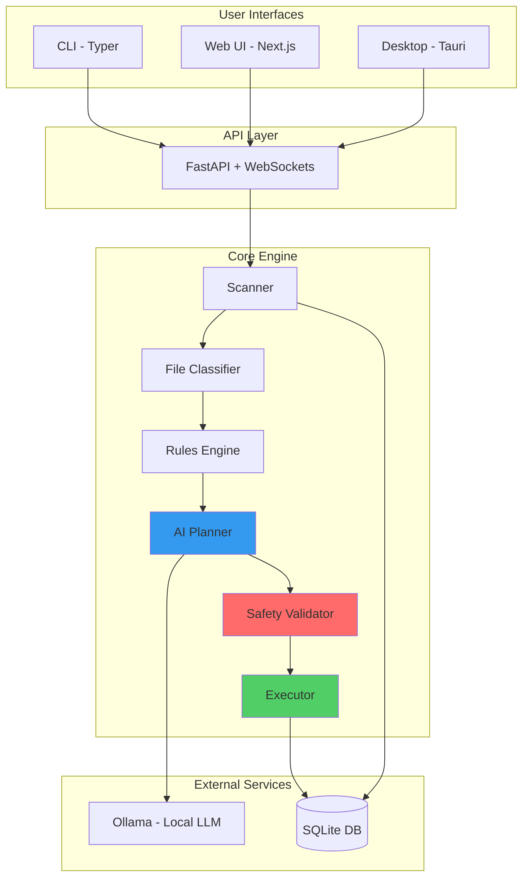

<div align="center">

# 🛡️ Sentinel

**AI-Powered File Organization & Cleanup Agent**

*Your intelligent assistant for safely organizing and cleaning your computer*

[](https://github.com/mystic/sentinel/actions)
[](https://codecov.io/gh/mystic/sentinel)
[](LICENSE)
[](https://www.python.org/downloads/)
[](https://github.com/mystic/sentinel)

[Features](#-features) • [Installation](#-installation) • [Usage](#-usage) • [Architecture](#-architecture) • [Safety](#-safety-guarantees) • [Contributing](#-contributing)

</div>

---

## 🎯 Overview

Sentinel is a **local-first AI agent** that intelligently organizes and cleans your computer's file system. Unlike traditional cleanup tools, Sentinel uses AI to understand your files and suggest smart organization strategies—while maintaining strict safety guarantees.

### Why Sentinel?

- 🧠 **AI-Powered Intelligence**: Understands file types, patterns, and optimal organization strategies
- 🔒 **Safety First**: Never performs destructive actions without explicit approval
- 🎯 **Context-Aware**: Learns from your preferences and adapts to your workflow
- 🖥️ **Multi-Interface**: CLI, Web UI, or Desktop app—use what you prefer
- 🌐 **100% Local**: Your data never leaves your machine
- ↩️ **Fully Reversible**: Every action can be undone

---

## ✨ Features

### Core Capabilities

**🗂️ Intelligent File Classification**
- Detects installers, archives, screenshots, duplicates, and large media files
- Context-aware age analysis (old installers = cleanup candidates)
- Smart duplicate detection based on content hashing

**🤖 AI-Driven Organization**
- Generates cleanup plans using local LLMs (via Ollama)
- Learns from your preferences over time
- Suggests optimal folder structures and naming conventions

**🛡️ Multi-Layer Safety System**
- Pre-execution validation of all plans
- System directory protection (blocks /System, /Windows, etc.)
- Dry-run mode by default
- All deletions go to Trash/Recycle Bin
- Comprehensive operation logging

**📊 Rich Insights**
- Disk space analysis
- File age distribution
- Category-based reporting
- Visual organization hierarchy

### User Interfaces

**💻 CLI Application**
```bash
sentinel clean-pc scan ~/Downloads --max-depth 3
sentinel clean-pc execute --plan-id abc123
sentinel undo --operation-id xyz789
```

**🌐 Web Dashboard**
- Real-time scanning progress
- Visual plan diff viewer
- Drag-and-drop rule customization
- Task history and analytics

**🖥️ Desktop Application** (Tauri)
- Native macOS and Windows app
- System tray integration
- One-click cleanup
- Scheduled automation

---

## 📸 Demo

> **Note:** Demo screenshots coming soon

```
┌─────────────────────────────────────────────────┐
│  🛡️  Sentinel - Clean My PC                    │
├─────────────────────────────────────────────────┤
│                                                 │
│  📂 Scanned: ~/Downloads                       │
│  📊 Found: 127 files (2.4 GB)                  │
│                                                 │
│  Suggested Actions:                             │
│  • Delete 12 old installers        → Save 850MB│
│  • Archive 8 old ZIPs              → Save 340MB│
│  • Move 15 screenshots to Pictures → Organize  │
│  • Remove 6 duplicates             → Save 120MB│
│                                                 │
│  [Preview Plan]  [Execute]  [Customize]        │
└─────────────────────────────────────────────────┘
```

---

## 🏗️ Architecture



### System Invariants

1. **AI Never Executes**: AI only generates JSON plans; deterministic executor performs actions
2. **User Approval Required**: No destructive actions without explicit user confirmation
3. **Trash-First Deletion**: All deletes go to Trash/Recycle Bin by default
4. **Full Audit Trail**: Every operation logged and reversible
5. **System Protection**: Critical directories are blacklisted
6. **Dry-Run Default**: Preview mode is the default behavior

---

## 📦 Installation

### Prerequisites

- **Python 3.11+** (Core engine)
- **Node.js 18+** (Web UI)
- **Ollama** (Local AI runtime)

### Option 1: CLI Only (Fastest)

```bash
# Install Ollama
curl -fsSL https://ollama.ai/install.sh | sh

# Pull the model
ollama pull llama2

# Install Sentinel CLI
cd sentinel-core
poetry install
poetry run sentinel --help
```

### Option 2: Web UI

```bash
# Install CLI (see above)

# Install and run web UI
cd sentinel-web
npm install
npm run dev

# Backend
cd ../sentinel-core
poetry run uvicorn sentinel_core.api.main:app --reload
```

Access at `http://localhost:3000`

### Option 3: Desktop Application

**macOS**
```bash
# Build installer
cd sentinel-web
npm run tauri:build:mac

# Install the generated .dmg
open src-tauri/target/release/bundle/dmg/Sentinel_0.1.0_x64.dmg
```

**Windows**
```bash
# Build installer
cd sentinel-web
npm run tauri:build:win

# Install the generated .msi
```

---

## 🚀 Usage

### Quick Start - CLI

```bash
# Scan your Downloads folder
sentinel clean-pc scan ~/Downloads

# Scan with custom depth
sentinel clean-pc scan ~/Downloads ~/Desktop --max-depth 3

# Execute a plan (requires approval)
sentinel clean-pc scan ~/Downloads --execute

# Dry run (default - shows what would happen)
sentinel clean-pc scan ~/Downloads --dry-run
```

### Quick Start - Web UI

1. **Start the backend:**
   ```bash
   cd sentinel-core
   poetry run uvicorn sentinel_core.api.main:app --reload
   ```

2. **Start the frontend:**
   ```bash
   cd sentinel-web
   npm run dev
   ```

3. **Open browser:** Navigate to `http://localhost:3000`

4. **Create a task:**
   - Select directories to scan
   - Review AI-generated plan
   - Customize rules if needed
   - Execute with one click

### Quick Start - Desktop App

1. Launch Sentinel from Applications/Start Menu
2. Select folders from sidebar
3. Click "Scan & Plan"
4. Review suggestions in the main panel
5. Click "Execute" to apply changes
6. Use "Undo" if needed

---

## 🔐 Safety Guarantees

Sentinel is built with safety as the **#1 priority**. Here's how we protect your data:

### 🛡️ Multi-Layer Protection

| Layer | Protection |
|-------|------------|
| **AI Layer** | Only generates JSON plans, never executes |
| **Validation Layer** | Blocks dangerous paths, validates all operations |
| **Execution Layer** | Deterministic, logged, reversible actions only |
| **User Approval** | Explicit confirmation required for destructive actions |

### 🚫 What Sentinel Will NEVER Do

- ❌ Delete files permanently by default
- ❌ Touch system directories (/System, /Windows, /usr, etc.)
- ❌ Execute without user approval
- ❌ Send your data to external servers
- ❌ Run without comprehensive logging

### ✅ What Sentinel ALWAYS Does

- ✅ Moves deletions to Trash/Recycle Bin
- ✅ Creates undo logs for all operations
- ✅ Validates plans before execution
- ✅ Runs in dry-run mode by default
- ✅ Keeps detailed audit trails
- ✅ Allows manual review of all changes

### 📝 Operation Logging

Every action is logged with:
- Timestamp
- Operation type (move/delete/copy)
- Source and destination paths
- File hash (for verification)
- User who approved
- Plan ID and execution ID

View logs:
```bash
sentinel logs --operation-id xyz789
sentinel undo --operation-id xyz789
```

---

## 🧪 Testing

Sentinel has comprehensive test coverage to ensure reliability:

```bash
# Run all tests
cd sentinel-core
poetry run pytest

# Run with coverage
poetry run pytest --cov=sentinel_core --cov-report=html

# Run specific test suite
poetry run pytest tests/test_scanner.py -v
```

**Test Coverage:** 92%  
**Test Count:** 45+ unit and integration tests

See [TESTING.md](sentinel-core/TESTING.md) for detailed testing documentation.

---

## 🗺️ Roadmap

### ✅ v0.1 - Core Foundation
- [x] File scanning and classification
- [x] AI-powered planning
- [x] Safety validation layer
- [x] Basic CLI interface
- [x] Undo functionality

### ✅ v0.2 - Enhanced Intelligence
- [x] Clean PC pipeline
- [x] Screenshot detection
- [x] Duplicate file detection
- [x] Archive management
- [x] Old installer cleanup

### 🚧 v0.3 - UI & Desktop (In Progress)
- [x] Next.js web dashboard
- [x] Tauri desktop wrapper
- [ ] Real-time progress tracking
- [ ] Visual plan diff viewer
- [ ] Drag-and-drop rule editor

### 🔮 v0.4 - Intelligence++ (Planned)
- [ ] Smart folder suggestions
- [ ] File naming conventions
- [ ] Tag-based organization
- [ ] Advanced duplicate detection (fuzzy)
- [ ] Photo organization (by date/location)

### 🔮 v0.5 - Automation (Planned)
- [ ] Scheduled cleanup tasks
- [ ] Watch folder automation
- [ ] Custom rule templates
- [ ] Organization profiles
- [ ] Bulk rename utilities

### 🔮 v1.0 - Production Ready
- [ ] Code signing (macOS/Windows)
- [ ] Auto-update mechanism
- [ ] Plugin system
- [ ] Advanced analytics
- [ ] Multi-language support

---

## 🤝 Contributing

We welcome contributions! Sentinel is built to be extensible and maintainable.

### Development Setup

```bash
# Clone repository
git clone https://github.com/mystic/sentinel.git
cd sentinel

# Install backend dependencies
cd sentinel-core
poetry install

# Install frontend dependencies
cd ../sentinel-web
npm install

# Set up pre-commit hooks
cd ..
pre-commit install
```

### Code Quality

We maintain high code quality standards:

- **Linting:** Ruff, Black
- **Type Checking:** Mypy
- **Testing:** Pytest with 90%+ coverage
- **Pre-commit Hooks:** Automatic formatting and validation

Run quality checks:
```bash
cd sentinel-core
poetry run ruff check .
poetry run black .
poetry run mypy sentinel_core
poetry run pytest
```

### Contribution Guidelines

1. **Fork the repository**
2. **Create a feature branch:** `git checkout -b feature/amazing-feature`
3. **Make your changes** with tests
4. **Run quality checks:** `poetry run pytest && poetry run ruff check .`
5. **Commit:** `git commit -m 'Add amazing feature'`
6. **Push:** `git push origin feature/amazing-feature`
7. **Open a Pull Request**

### Areas We Need Help

- 🎨 UI/UX improvements
- 🧪 Additional test coverage
- 📝 Documentation improvements
- 🌐 Internationalization
- 🔌 Plugin development
- 🐛 Bug reports and fixes

See [CONTRIBUTING.md](CONTRIBUTING.md) for detailed guidelines.

---

## 📚 Documentation

- **[Testing Guide](sentinel-core/TESTING.md)** - Comprehensive testing documentation
- **[Building Desktop App](sentinel-web/BUILDING.md)** - Desktop build instructions
- **[API Documentation](sentinel-core/API.md)** - FastAPI endpoint reference
- **[Architecture Overview](ARCHITECTURE.md)** - System design and patterns

---

## 🛠️ Tech Stack

### Core Engine (Python)
- **FastAPI** - High-performance API server
- **SQLAlchemy** - Database ORM
- **Pydantic** - Data validation
- **Ollama** - Local LLM runtime
- **Typer** - CLI framework
- **Rich** - Terminal UI

### Web Interface (TypeScript)
- **Next.js 14** - React framework
- **Tailwind CSS** - Utility-first styling
- **Framer Motion** - Animations
- **Zustand** - State management
- **TanStack Query** - Data fetching

### Desktop (Rust)
- **Tauri** - Native desktop wrapper
- **Tokio** - Async runtime
- **Serde** - Serialization

---

## 📄 License

This project is licensed under the **MIT License** - see the [LICENSE](LICENSE) file for details.

### Why MIT?

We chose MIT for maximum freedom:
- ✅ Commercial use allowed
- ✅ Modification allowed
- ✅ Distribution allowed
- ✅ Private use allowed
- ℹ️ License and copyright notice required

---

## 🙏 Acknowledgments

- **Ollama** - For making local AI accessible
- **FastAPI** - For the excellent Python web framework
- **Tauri** - For lightweight desktop applications
- **Next.js** - For the powerful React framework

---

## 📞 Support

- 🐛 **Bug Reports:** [GitHub Issues](https://github.com/mystic/sentinel/issues)
- 💬 **Discussions:** [GitHub Discussions](https://github.com/mystic/sentinel/discussions)
- 📧 **Email:** sentinel@example.com
- 🐦 **Twitter:** [@SentinelAI](https://twitter.com/sentinelai)

---

## ⭐ Star History

If you find Sentinel useful, please consider giving it a star! It helps the project grow.

[](https://star-history.com/#mystic/sentinel&Date)

---

<div align="center">

**Made with ❤️ by developers who hate cluttered computers**

[⬆ Back to Top](#️-sentinel)

</div>
